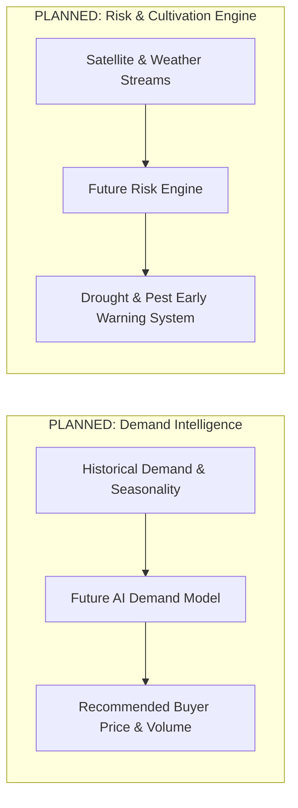

# AgriGrowth System Architecture & Design Specification

## 1. System Overview

AgriGrowth is built as a modern full-stack web application leveraging Next.js 16 App Router, TypeScript, Prisma ORM, SQLite, and Python Google OR-Tools optimization engine.

---

## 2. Layered Architecture Diagram

```mermaid
graph TD
    subgraph Client Layer
        B[Buyer Dashboard]
        F[Farmer Dashboard]
        W[Field Worker Portal]
        I[Quality Inspector View]
        CM[Center Manager Hub]
        T[Transporter Fleet Dashboard]
    end

    subgraph Application & API Layer (Next.js App Router)
        Auth[Session Auth Guard - auth.ts]
        API_Contracts[Contracts & Milestones API]
        API_Demands[Buyer Demands API]
        API_Lands[Land Registry API]
        API_Worker[Worker Jobs & Reporting API]
        API_Inspections[Quality Inspections API]
        API_Logistics[Shipments & Fleet API]
        API_Opt[Route Optimization API]
    end

    subgraph Data Persistence Layer
        Prisma[Prisma Client ORM]
        DB[(SQLite Database - dev.db)]
    end

    subgraph External & Optimization Services
        GoogleMatrix[Google Routes API / Distance Matrix]
        ORTools[Python OR-Tools CP-SAT Solver]
    end

    subgraph Planned Intelligence (Future Extensions)
        DemandAI[PLANNED: AI Demand Forecasting]
        RiskAI[PLANNED: Weather & Risk Engine]
    end

    B --> Auth
    F --> Auth
    W --> Auth
    I --> Auth
    CM --> Auth
    T --> Auth

    Auth --> API_Contracts
    Auth --> API_Demands
    Auth --> API_Lands
    Auth --> API_Worker
    Auth --> API_Inspections
    Auth --> API_Logistics
    Auth --> API_Opt

    API_Contracts --> Prisma
    API_Demands --> Prisma
    API_Lands --> Prisma
    API_Worker --> Prisma
    API_Inspections --> Prisma
    API_Logistics --> Prisma
    Prisma --> DB

    API_Opt --> GoogleMatrix
    API_Opt --> ORTools
    ORTools --> Prisma
```

---

## 3. Logistics & Route Optimization Data Flow

```mermaid
sequenceDocument
    Collection Centers + Harvest Receipts + Vehicles
                         ↓
              Route Optimization Input
                         ↓
                Google Routes API
                         ↓
             Road Distance/Time Matrix
                         ↓
                OR-Tools Optimizer (solve.py)
                         ↓
             Vehicle Routes / Consolidated Shipments
```

### Detailed Solver Mechanics:
1. **Stage 1 (Lot Selection)**: Evaluates inspected harvest receipts against buyer demand, selecting candidate lots that meet volume and quality constraints.
2. **Stage 2 (Matrix Building)**: Queries Google Routes API (or matrix fallback) for exact road distance and duration between vehicle start locations, collection hubs, and buyer delivery destination.
3. **Stage 3 (Constraint Optimization)**: Passes distance matrix, vehicle capacity limits, and pickup constraints into Python OR-Tools CP-SAT solver script (`optimizer/solve.py`).
4. **Stage 4 (Dispatch Generation)**: Generates optimal vehicle routes, assigned loads, and dispatch itineraries without brute-force subset enumeration.

---

## 4. Planned Intelligence Architecture (Future Roadmap)



---

## 5. Technology Stack Summary

| Layer | Component | Description |
| :--- | :--- | :--- |
| **Frontend** | React 19 / Next.js 16 | App Router, Server & Client Components, Tailwind CSS v4, Lucide Icons |
| **Backend** | Node.js / TypeScript | Next.js API Routes, Cookie-based Session Authentication |
| **Database** | SQLite + Prisma ORM | Relational schema with index optimization and type-safe client generation |
| **Logistics API** | Google Routes API | Real-time road distance and travel time matrix evaluation |
| **Optimization Solver** | Python 3 + Google OR-Tools | CP-SAT solver for Vehicle Routing Problem (VRP) with capacity constraints |
